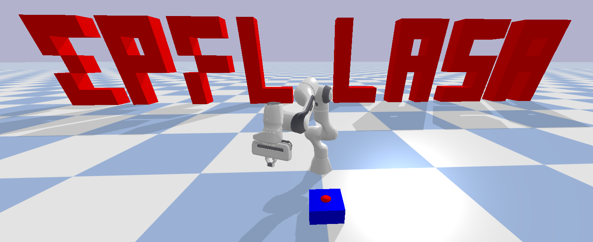
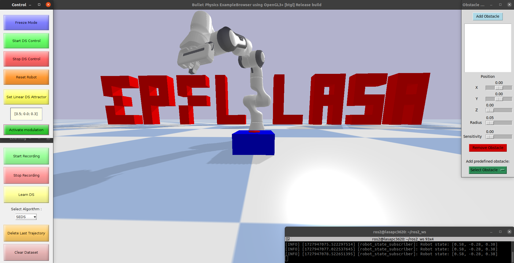

---
layout: page
permalink: /documentation/L13-Practical_3.html
header: yes
<!-- header_sm: images/Header.png
header_med: images/Header.png
header_large: images/Header.png
header_xl: images/Header.png -->
header_sm: images/headers.gif
header_med: images/headers.gif
header_large: images/headers.gif
header_xl: images/headers.gif
--- 

<section class="small-12 large-10 columns page-content">
    

<h1 align="center"> <strong>Lecture 13 - Practical III</strong></h1>

 

<h2 align="center"> <strong> Abstract </strong> </h2>

    
     

 

 This week, the 4h for the course are dedicated to a practice session to explore learning and modulations of a dynamical system with on a 7 DOF robot manipulator. Students will teach kinesthetic demonstrations to a robot in simulation and test the behavior of the robot when followign the dynamical system learned form those demonstrations. A sandbox simulated environment is proposed, where students can add and modify spherical obstacles and play with different algorithms for control and obstacle avoidance. 

 

   

 

 Several Graphical User Interfaces are made available to control both the robot and its environment. Students will not need to program anything for this practical. 

 

   

 

<h2 align="center">  <strong> Practical Instructions </strong>  </h2>

    
     

 

 Click <a href="https://www.epfl.ch/labs/lasa/wp-content/uploads/2024/10/Instructions_Practical_3_Sim.pdf" target="_blank" style="color: red;"> here </a> to download a pdf of the instructions for the exercises.

 

<h2 align="center"><strong>Code for MATLAB Exercises</strong></h2>

    
     

 

 The recommended way to do the MATLAB exercises is to download the entire repository once, then go to each lecture's folder. Detailled instructions for installation can be found on the <a href="Software.html" style="color: blue;">Software</a> page. 

 

 Click <a href="https://www.epfl.ch/labs/lasa/wp-content/uploads/2024/10/practical_3_sim.zip" target="_blank" style="color: red;"> here </a> to download the code for the practical as a zip file.   Note you will also need this <a href="https://www.epfl.ch/labs/lasa/wp-content/uploads/2024/09/libraries.zip" target="_blank" style="color: red;"> libraries </a> folder placed with the correct directory structure.  
 

 

<h2 align="center"><strong>Solutions</strong></h2>

    
     

 

There are no solutions for this practical.

