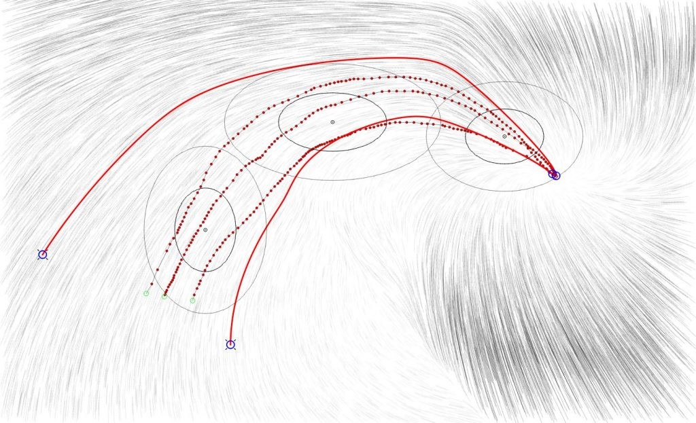
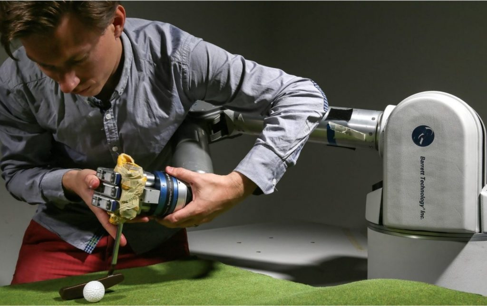

---
layout: page
permalink: /documentation/L5-Practical_1.html
header: yes
<!-- header_sm: images/Header.png
header_med: images/Header.png
header_large: images/Header.png
header_xl: images/Header.png -->
header_sm: images/headers.gif
header_med: images/headers.gif
header_large: images/headers.gif
header_xl: images/headers.gif
--- 

<section class="small-12 large-10 columns page-content">
    

<h1 align="center"> <strong>Lecture 5 - Practical I</strong></h1>

 

<h2 align="center"> <strong> Abstract </strong> </h2>

    
     

 

 This week, the 4h for the course are dedicated to a practice session to train and test dynamical systems with different datasets and algorithms. The purpose of this pratical is to explore how data collection, and the ensuing quality of data will impact the learning of a given algorithms. In a secont part, students will test different learning algorithms. 

 
<!-- 
   
 -->

   

 
<h2 align="center">  <strong>  Practical Instructions </strong>  </h2>

    
     

 

 Click <a href="https://www.epfl.ch/labs/lasa/wp-content/uploads/2022/11/Instructions_Practical_1.pdf" target="_blank" style="color: red;"> here </a> to download a pdf of the instructions for the exercises.

 

<h2 align="center"><strong>Code for MATLAB Exercises</strong></h2>

    
     

 

 The recommended way to do the MATLAB exercises is to download the entire repository once, then go to each lecture's folder. Detailled instructions for installation can be found on the <a href="Software.html" style="color: blue;">Software</a> page. 

 

 Click <a href="https://www.epfl.ch/labs/lasa/wp-content/uploads/2024/09/practical_1.zip" target="_blank" style="color: red;"> here </a> to download the corresponding exercise for this lecture as a zip file.   Note you will also need this <a href="https://www.epfl.ch/labs/lasa/wp-content/uploads/2024/09/libraries.zip" target="_blank" style="color: red;"> libraries </a> folder placed with the correct directory structure.  
 

 

<h2 align="center"><strong>Solutions</strong></h2>

    
     

 

Click <a href="https://github.com/learningadaptivereactiverobotcontrol/book-code/tree/practicals_solutions/practical_1" target="_blank" style="color: blue;">here</a> to find the solutions on a seprate branch.

