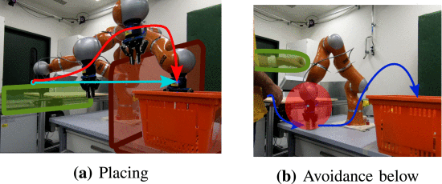
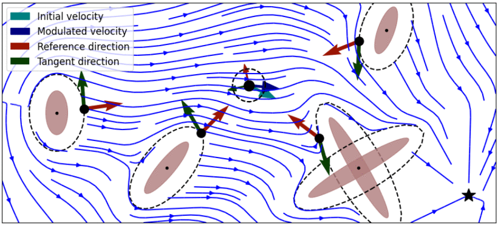
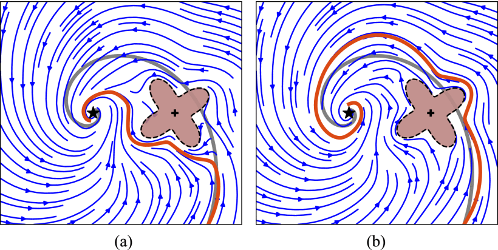
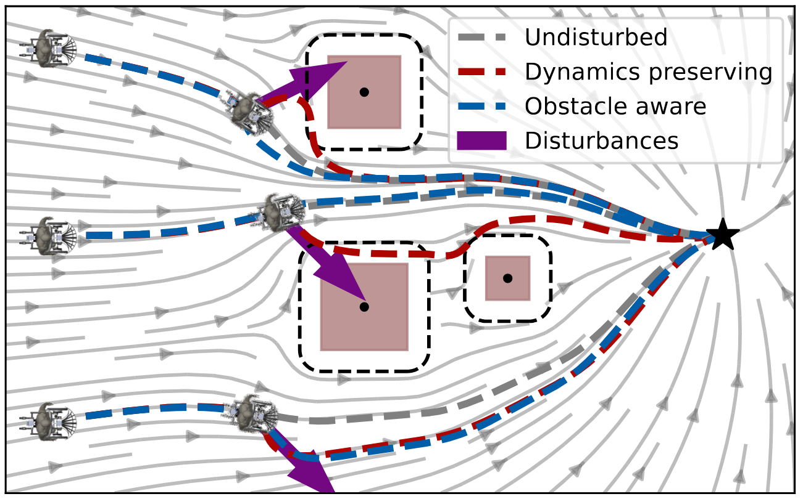
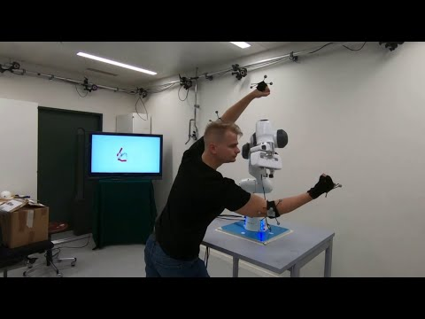

---
layout: page
permalink: /documentation/L7-Avoidance.html
header: yes
<!-- header_sm: images/Header.png
header_med: images/Header.png
header_large: images/Header.png
header_xl: images/Header.png -->
header_sm: images/headers.gif
header_med: images/headers.gif
header_large: images/headers.gif
header_xl: images/headers.gif
--- 

<section class="small-12 large-10 columns page-content">
    

<h1 align="center"><strong>Lecture 7 - Obstacle Avoidance with Dynamical Systems</strong></h1>

 

<h2 align="center"><strong>Abstract</strong></h2>

    
     

 

 This lecture presents how dynamical systems can be used to create robust obstacle avoidance when controlling robots. In order to guarantee obstacle avoidance, one can locally modulate the dynamical system (DS) to contour obstacles or to remain within a given workspace. Importantly, while doing so, we can preserve some of the inherent properties of the DS, such as convergence on a given target. We start with a modulation that allows for avoiding convex obstacles, and then extend it to concave obstacles and to multiple obstacles in movement. We show that the formulation can also be used to enforce a flow to move inside a volume, which would be useful to ensure that the path stays within the robot’s workspace.

 

<h2 align="center"><strong>Lecture Video</strong></h2>

    
     

 

<iframe id="kmsembed-0_alylq824" width="608" height="402" src="https://mediaspace.epfl.ch/embed/secure/iframe/entryId/0_alylq824/uiConfId/23448972/pbc/30620/st/0" class="kmsembed" allowfullscreen webkitallowfullscreen mozAllowFullScreen allow="autoplay *; fullscreen *; encrypted-media *" referrerPolicy="no-referrer-when-downgrade" sandbox="allow-downloads allow-forms allow-same-origin allow-scripts allow-top-navigation allow-pointer-lock allow-popups allow-modals allow-orientation-lock allow-popups-to-escape-sandbox allow-presentation allow-top-navigation-by-user-activation" frameborder="0" title="Lecture 7 | Learning and adaptive control course, Obstacle Avoidance with DS"></iframe>

 

<h2 align="center"><strong>Slides</strong></h2>

    
     

 

 Click <a href="https://www.epfl.ch/labs/lasa/wp-content/uploads/2022/05/Lect7_Obstacle-Avoidance.pdf" target="_blank" style="color: red;"> here </a> to download a pdf version of the ppt presentation.

 

<h2 align="center"><strong>Exercises Instructions</strong></h2>

    
     

 

 Click <a href="https://www.epfl.ch/labs/lasa/wp-content/uploads/2022/11/Instructions_Lecture_7.pdf" target="_blank" style="color: red;"> here </a> to download a pdf of the instructions for the exercises.

 

<h2 align="center"><strong>Code for MATLAB Exercises</strong></h2>

    
     

 

 The recommended way to do the MATLAB exercises is to download the entire repository once, then go to each lecture's folder. Detailled instructions for installation can be found on the <a href="Software.html" style="color: blue;">Software</a> page. 

 

 Click <a href="https://www.epfl.ch/labs/lasa/wp-content/uploads/2024/09/lecture7-obstacle-avoidance.zip" target="_blank" style="color: red;"> here </a> to download the corresponding exercise for this lecture as a zip file.   Note you will also need this <a href="https://www.epfl.ch/labs/lasa/wp-content/uploads/2024/09/libraries.zip" target="_blank" style="color: red;"> libraries </a> folder placed with the correct directory structure.  
 

 

<h2 align="center"><strong>First Theoretical Exercise Solution</strong></h2>

    
     

 

 Click <a href="https://www.epfl.ch/labs/lasa/wp-content/uploads/2024/08/Solution_Lecture_7.pdf" target="_blank" style="color: red;"> here </a> to download a pdf of the solution of the first handwritten exercise.
   

  

 
<h2 align="center"><strong>Supplements</strong></h2>

 

<h3 align="center"><strong>Guaranteed obstacle avoidance of dense and dynamic obstacles in enclosed spaces</strong></h3>
<!-- <h3 align="left"><strong>Exact obstacle avoidance in complex and dynamic environments </strong></h3> -->
 
<!-- LUKAS -->

  <iframe width="560" height="315" 
    src="https://www.youtube.com/embed/HbNxEVP3pJA" 
    title="YouTube video player" 
    frameborder="0" 
    allow="accelerometer; autoplay; clipboard-write; encrypted-media; gyroscope; picture-in-picture; web-share" 
    allowfullscreen>
  </iframe>

<!-- 
  
 -->
 

 

 <a href="https://ieeexplore.ieee.org/abstract/document/8616899" style="color: blue;">L. Huber,
A. Billard and J.-J. Slotine (2019) "Avoidance of Convex and Concave Obstacles With Convergence Ensured Through Contraction". In IEEE Robotics and Automation Letters 4 (2), 1462-1469.</a> 

    
     

<a href="https://ieeexplore.ieee.org/abstract/document/9765824" style="color: blue;">L. Huber,
 J.-J. Slotine and A. Billard (2022) "Avoiding Dense and Dynamic Obstacles in Enclosed Spaces: Application to Moving in Crowds". In IEEE Transactions on Robotics 38 (5), 3113-3132.</a>

 

Python packages by Lukas Huber for : 

        

            <a href="https://github.com/hubernikus/nonlinear_obstacle_avoidance" style="color: blue;"  target="_blank"> Non linear obstacle avoidance</a>
        

        

            <a href="https://github.com/hubernikus/dynamic_obstacle_avoidance" style="color: blue;"  target="_blank"> Dynamic obstacle avoidance </a>
        

        <!-- 

            <a href="https://github.com/hubernikus/fast_obstacle_avoidance" style="color: blue;" target="_blank"> Fast obstacle avoidance</a>
        
 -->

 

 This is a closed-form approach to obstacle avoidance for multiple moving convex and star-shaped concave obstacles, inspired from harmonic-potentials fields. It was applied on an autonomous robot (QOLO) in a static complex indoor environment and tested in simulations with dense crowds.  
 
<i>Obstacle Type </i> : Convex, Concave, multiple, moving   
<i>Theoritical guarantees</i>  : Asymptotic stability, Impenetrability of obstacles hull  
<i>Type of dynamics</i>  : non-linear, task-space  

 
 
<!-- <h3 align="left"><strong>Guaranteed avoidance of convex and concave obstacles </strong></h3> -->
<h3 align="center"><strong>Fast obstacle avoidance</strong></h3>
 
<!-- LUKAS -->

  

 

 <a href="https://ieeexplore.ieee.org/abstract/document/9999335" style="color: blue;">L. Huber,
A. Billard and J.-J. Slotine (2022) "Fast Obstacle Avoidance Based on Real-Time Sensing". In IEEE Robotics and Automation Letters (RA-L).</a>

 

Python packages by Lukas Huber for : <a href="https://github.com/hubernikus/fast_obstacle_avoidance" style="color: blue;" target="_blank"> Fast obstacle avoidance</a>

 

 This method addresses the issue of enabling obstacle avoidance based on sparse and asynchronous perception. The proposed control scheme combines a high-level input command provided by either a planner or a human operator with fast reactive obstacle avoidance (FOA). The sampling-based sensor data can be combined with an analytical reconstruction of the obstacles for real-time collision avoidance.   
 
<i>Obstacle Type</i>  : Convex, star-shaped, multiple, moving   
<i>Theoritical guarantees</i>  : Asymptotic stability, Impenetrability of obstacles hull  
<i>Type of dynamics</i>  : non-linear 

 
 

<h3 align="center"><strong>Avoidance of concave obstacles through rotation of nonlinear dynamics</strong></h3>
 

  

 

 <a href="https://ieeexplore.ieee.org/document/10363679" style="color: blue;">L. Huber,
J.-J. Slotine and A. Billard (2023) "Avoidance of concave obstacles through rotation of nonlinear dynamics". In IEEE Transaction on Robotics.</a>

 

 Controlling complex tasks in robotic systems, such as circular motion for cleaning or following curvy lines, can be dealt with using nonlinear vector fields. This article introduces a novel approach called the rotational obstacle avoidance method (ROAM) for adapting the initial dynamics when obstacles partially occlude the workspace. ROAM presents a closed-form solution that effectively avoids star-shaped obstacles in spaces of arbitrary dimensions by rotating the initial dynamics toward the tangent space. The algorithm enables navigation within obstacle hulls and can be customized to actively move away from surfaces while guaranteeing the presence of only a single saddle point on the boundary of each obstacle. We introduce a sequence of mappings to extend the approach for general nonlinear dynamics. 

 
<i>Obstacle Type</i>  : Convex, star-shaped, multiple, moving   
<i>Theoritical guarantees</i>  : single saddle point on boundary of obstacle, Impenetrability of obstacles hull  
<i>Type of dynamics</i>  : dynamic, non-linear 
  

<h3 align="center"><strong>Passive obstacle aware control to follow desired velocities</strong></h3>
 

  

 

  <a href="https://arxiv.org/abs/2405.05669" style="color: blue;">L. Huber, T. Trinca,
J.-J. Slotine and A. Billard (2024) "Passive Obstacle Aware Control to Follow Desired Velocities".</a>

 

 Evaluating and updating the obstacle avoidance velocity for an autonomous robot in real-time ensures robustness against noise and disturbances. A passive damping controller can obtain the desired motion with a torque-controlled robot, which remains compliant and ensures a safe response to external perturbations. Here, we propose a novel approach for designing the passive control policy. Our algorithm complies with obstacle-free zones while transitioning to increased damping near obstacles to ensure collision avoidance. This approach ensures stability across diverse scenarios, effectively mitigating disturbances. Validation on a 7DoF robot arm demonstrates superior collision rejection capabilities compared to the baseline, underlining its practicality for real-world applications. Our obstacle-aware damping controller represents a substantial advancement in secure robot control within complex and uncertain environments.  

  

<h3 align="center"><strong>Real-time Joint-Space Obstacle Avoidance</strong></h3>
 
<!-- KOPTEV -->

  <iframe width="608" height="402"  
    src="https://www.youtube.com/embed/u3lTwFZFicY" 
    title="YouTube video player" 
    frameborder="0" 
    allow="accelerometer; autoplay; clipboard-write; encrypted-media; gyroscope; picture-in-picture; web-share" 
    allowfullscreen>
  </iframe>

 

 <a href="https://ieeexplore.ieee.org/abstract/document/9345975" style="color: blue;">M Koptev, N Figueroa, A Billard (2022) "Real-Time Self-Collision Avoidance in Joint Space for Humanoid Robots". In IEEE Robotics and Automation Letters 6 (2), 1240-1247.</a> 

 

  

<!-- 
   
 -->

 

 <a href="https://ieeexplore.ieee.org/abstract/document/9976191" style="color: blue;">M Koptev, N Figueroa, A Billard (2022) "Neural Joint Space Implicit Signed Distance Functions for Reactive Robot Manipulator Control". In IEEE Robotics and Automation Letters 8 (2), 480-487.</a> 

 

Python code by Mikhail Koptev for : <a href="https://github.com/epfl-lasa/OptimalModulationDS" style="color: blue;" target="_blank"> Reactive joint space obstacle avoidance</a>.

 

 This method uses a neural implicit signed distance function expressed in joint space coordinates, that efficiently computes distance-to-collisions for arbitrary robotic manipulator configurations. This distance function can be used to achieve real-time reactive control by i) formulating it as a collision-avoidance constraint for a quadratic programming (QP) inverse kinematics (IK), and ii) introducing it as a collision cost in a sampling-based joint space model predictive controller (MPC).  
 
<i>Obstacle Type</i>  : Convex, Concave, multiple, moving  
<i>Theoritical guarantees</i>  :  
<i>Type of dynamics</i>  : non-linear, joint-space  

