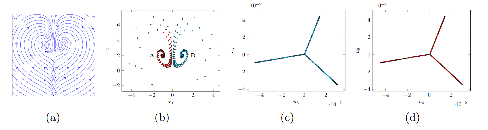
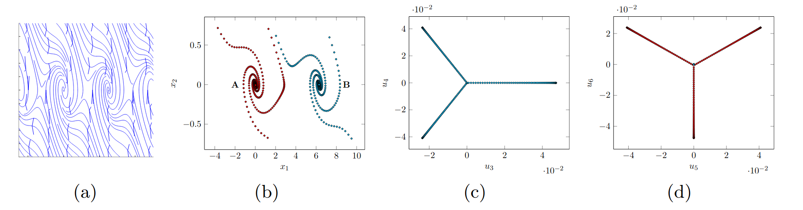
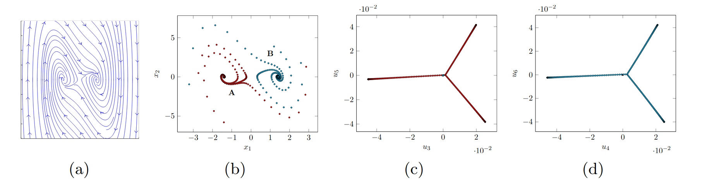
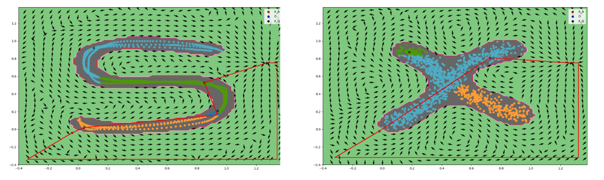

---
layout: page
permalink: /documentation/Supplements.html
header: yes
<!-- header_sm: images/Header.png
header_med: images/Header.png
header_large: images/Header.png
header_xl: images/Header.png -->
header_sm: images/headers.gif
header_med: images/headers.gif
header_large: images/headers.gif
header_xl: images/headers.gif
--- 

<section class="small-12 large-10 columns page-content">

<h1 align="center"><strong>Supplements for Learning Adaptive and Reactive Robot Control</strong></h1>

 
<h2 align="center"><strong>Learning Control Laws</strong></h2>
 

<h3 align="center"><strong>Multi-attractor DS</strong></h3>
 
<!-- BERNARDO -->

   

   

   

 

 (a) Original Vector field  (b) Sub-Sampled trajectories from the DS. (c)
Embedding space of the sub-dynamics with a local attractor. (d) Embedding space of the
sub-dynamics with a local attractor.

 

 <a href="https://www.jmlr.org/papers/v23/20-1405.html" style="color: blue;">B. Fischera and A. Billard (2022) "Linearization and Identification of Multiple-Attractor Dynamical Systems through Laplacian Eigenmaps". In Journal of Machine Learning Research.</a> 

 

 We propose a Graph-based spectral clustering method that takes advantage of a velocity-augmented kernel to connect data points belonging to the same dynamics, while preserving the natural temporal evolution. We study the eigenvectors and eigenvalues of the Graph Laplacian and show that they form a set of orthogonal embedding spaces, one for each sub-dynamics. We prove that there always exist a set of 2-dimensional embedding spaces in which the sub-dynamics are linear and n-dimensional embedding spaces where they are quasi-linear. We compare the clustering performance of our algorithm to Kernel K-Means, Spectral Clustering and Gaussian Mixtures and show that, even when these algorithms are provided with the correct number of sub-dynamics, they fail to cluster them correctly. We learn a diffeomorphism from the Laplacian embedding space to the original space and show that the Laplacian embedding leads to good reconstruction accuracy and a faster training time through an exponential decaying loss compared to the state-of-the-art diffeomorphism-based approaches.   
 
<!-- <i>Obstacle Type</i>  : Convex, Concave, multiple, moving  
<i>Theoritical guarantees</i>  :  
<i>Type of dynamics</i>  : non-linear, joint-space   -->

<h3 align="center"><strong>Dynamical system approach to navigation around obstacles</strong></h3>
 
<!-- ARADHANA -->

   

 

<a href="https://infoscience.epfl.ch/server/api/core/bitstreams/f2740d17-1ceb-4c7c-881f-7da4a35f5daa/content" style="color: blue;"> A. Nayak and A. Billard (2024) "Dynamical system approach to navigation around obstacles". In European Control Conference. </a> 

 

 In this article, we propose a dynamical system to
avoid obstacles which are star shaped and simultaneously
converge to a goal. The convergence is almost-global in a
domain and the stationary points are identified explicitly.
Our approach is based on the idea that an ideal vector
field which avoids the obstacle traverses its boundary up
to when a clear path to the goal is available. We show
the existence of this clear path through a set connecting
the boundary of the obstacle and the goal. The traversing
vector field is determined for an arbitrary obstacle (de-
scribed by a set of points) by separating it into cluster of
stars. We propose an algorithm which is linear in number
of points inside the obstacle. We verify the theoretical
results presented with various hand drawn obstacle sets.
Our methodology is also extended to obstacles which are
not star-shaped, and, those which exist in high dimensions. 
 
 

 
<h2 align="center"><strong>Obstacle Avoidance</strong></h2>
 

<h3 align="center"><strong>Guaranteed obstacle avoidance of dense and dynamic obstacles in enclosed spaces</strong></h3>
<!-- <h3 align="left"><strong>Exact obstacle avoidance in complex and dynamic environments </strong></h3> -->
 
<!-- LUKAS -->

  

 
<!-- 
  

  -->

 

  <i> Papers </i> : <a href="https://ieeexplore.ieee.org/abstract/document/8616899" style="color: blue;">L. Huber,
A. Billard and J.-J. Slotine (2019) "Avoidance of Convex and Concave Obstacles With Convergence Ensured Through Contraction". In IEEE Robotics and Automation Letters 4 (2), 1462-1469.</a>  
<a href="https://ieeexplore.ieee.org/abstract/document/9765824" style="color: blue;">L. Huber,
 J.-J. Slotine and A. Billard (2022) "Avoiding Dense and Dynamic Obstacles in Enclosed Spaces: Application to Moving in Crowds". In IEEE Transactions on Robotics 38 (5), 3113-3132.</a>

 

Python packages by Lukas Huber for : 

        

            <a href="https://github.com/hubernikus/nonlinear_obstacle_avoidance" style="color: blue;"  target="_blank"> Non linear obstacle avoidance</a>
        

        

            <a href="https://github.com/hubernikus/dynamic_obstacle_avoidance" style="color: blue;"  target="_blank"> Dynamic obstacle avoidance </a>
        

        <!-- 

            <a href="https://github.com/hubernikus/fast_obstacle_avoidance" style="color: blue;" target="_blank"> Fast obstacle avoidance</a>
        
 -->

 

 This is a closed-form approach to obstacle avoidance for multiple moving convex and star-shaped concave obstacles, inspired from harmonic-potentials fields. It was applied on an autonomous robot (QOLO) in a static complex indoor environment and tested in simulations with dense crowds.  
 
<i>Obstacle Type </i> : Convex, Concave, multiple, moving   
<i>Theoritical guarantees</i>  : Asymptotic stability, Impenetrability of obstacles hull  
<i>Type of dynamics</i>  : non-linear, task-space  

 
 
<!-- <h3 align="left"><strong>Guaranteed avoidance of convex and concave obstacles </strong></h3> -->
<h3 align="center"><strong>Fast obstacle avoidance</strong></h3>
 
<!-- LUKAS -->

  

 

  <i> Paper</i>  : <a href="https://ieeexplore.ieee.org/abstract/document/9999335" style="color: blue;">L. Huber,
A. Billard and J.-J. Slotine (2022) "Fast Obstacle Avoidance Based on Real-Time Sensing". In IEEE Robotics and Automation Letters (RA-L).</a>

 

Python packages by Lukas Huber for : 

        

            <a href="https://github.com/hubernikus/fast_obstacle_avoidance" style="color: blue;" target="_blank"> Fast obstacle avoidance</a>
        

 

 This method addresses the issue of enabling obstacle avoidance based on sparse and asynchronous perception. The proposed control scheme combines a high-level input command provided by either a planner or a human operator with fast reactive obstacle avoidance (FOA). The sampling-based sensor data can be combined with an analytical reconstruction of the obstacles for real-time collision avoidance.   
 
<i>Obstacle Type</i>  : Convex, star-shaped, multiple, moving   
<i>Theoritical guarantees</i>  : Asymptotic stability, Impenetrability of obstacles hull  
<i>Type of dynamics</i>  : non-linear 

  

<h3 align="center"><strong>Real-time Joint-Space Obstacle Avoidance</strong></h3>
 
<!-- KOPTEV -->

  

<!-- 
   
 -->
 
    

  <i> Paper</i>  : <a href="https://ieeexplore.ieee.org/abstract/document/9976191" style="color: blue;">M Koptev, N Figueroa, A Billard (2022) "Neural Joint Space Implicit Signed Distance Functions for Reactive Robot Manipulator Control". In IEEE Robotics and Automation Letters 8 (2), 480-487.</a> 

 

Python code by Mikhail Koptev for <a href="https://github.com/epfl-lasa/OptimalModulationDS" style="color: blue;" target="_blank"> reactive joint space obstacle avoidance</a>.

 

 This method uses a neural implicit signed distance function expressed in joint space coordinates, that efficiently computes distance-to-collisions for arbitrary robotic manipulator configurations. This distance function can be used to achieve real-time reactive control by i) formulating it as a collision-avoidance constraint for a quadratic programming (QP) inverse kinematics (IK), and ii) introducing it as a collision cost in a sampling-based joint space model predictive controller (MPC).  
 
<i>Obstacle Type</i>  : Convex, Concave, multiple, moving  
<i>Theoritical guarantees</i>  :  
<i>Type of dynamics</i>  : non-linear, joint-space  

<!-- 

FORMAT FOR REFERENCES 
### References
[1] Figueroa, N. and Billard, A. (2018) "A Physically-Consistent Bayesian Non-Parametric Mixture Model for Dynamical System Learning". In Proceedings of the 2nd Conference on Robot Learning (CoRL).   -->